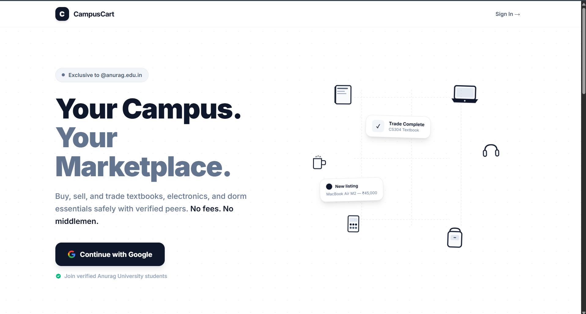
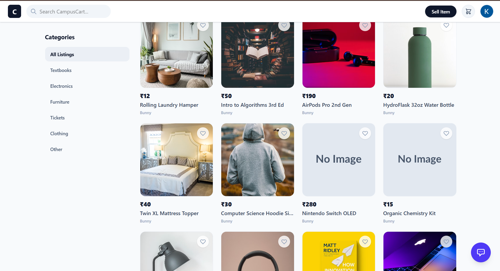
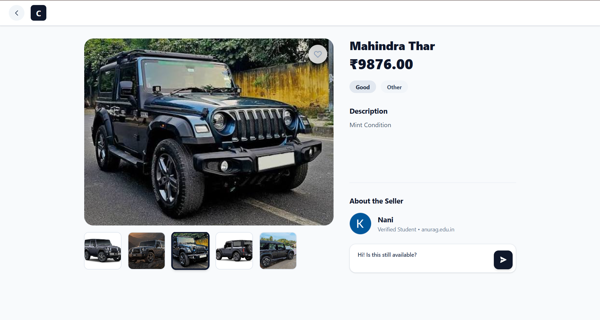
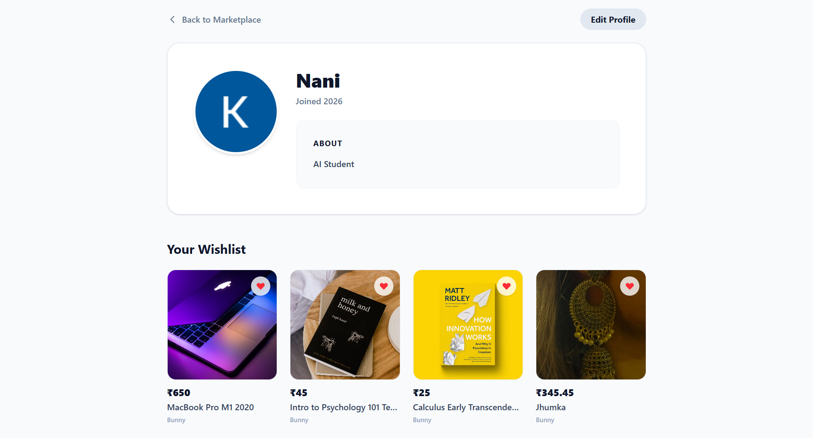

<div align="center">
  
  <h1>CampusCart</h1>
  <p>Your Campus. Your Marketplace.</p>
</div>

<p align="center">
  An exclusive, secure, and modern marketplace for university students to buy, sell, and trade textbooks, electronics, and dorm essentials with verified peers. No fees. No middlemen.
</p>

---

## 📸 Screenshots

*Click on the images below to expand them.*

| Landing Page | Marketplace Feed |
|:---:|:---:|
|  |  |

| Item Details & Chat | User Profile & Wishlist |
|:---:|:---:|
|  |  |

---

## ✨ Features

- **Exclusive Access:** Only students with a verified university email (e.g., `@anurag.edu.in`) can log in via Google OAuth2. Keeps the marketplace safe and localized.
- **Real-Time Chat:** Integrated WebSockets (STOMP) allow buyers and sellers to negotiate instantly right inside the app.
- **Infinite Scroll:** Seamlessly browse listings with cursor/offset-based pagination powered by React Query and Spring Data.
- **Wishlist:** Save your favorite listings to view later directly from your profile.
- **Image Uploads:** Fast and secure image hosting via Cloudinary.
- **Modern UI:** A beautiful, responsive, and deeply polished user interface built with Tailwind CSS.

## 🛠️ Tech Stack

### Frontend (Web)
- **React (Vite)**
- **TypeScript**
- **Tailwind CSS** (for styling)
- **React Query** (for data fetching and caching)
- **React Router** (for navigation)
- **SockJS & StompJS** (for WebSocket connections)

### Backend
- **Java / Spring Boot 3**
- **Spring Security & OAuth2** (Google Sign-In)
- **Spring Data JPA / Hibernate**
- **PostgreSQL** (Database)
- **Flyway** (Database Migrations)
- **Cloudinary** (Image Storage)

---

## 🚀 Getting Started

### Prerequisites
- Node.js (v18+)
- Java 17+
- PostgreSQL
- A Google Cloud Project (for OAuth2 credentials)
- A Cloudinary Account (for image uploads)

### 1. Clone the Repository
```bash
git clone https://github.com/Ram-ambati/CampusCart.git
cd CampusCart
```

### 2. Backend Setup
Navigate to the backend directory and configure your environment variables.
```bash
cd backend
```
Create an `application.properties` or set your environment variables for:
- `DB_URL`, `DB_USERNAME`, `DB_PASSWORD`
- `GOOGLE_CLIENT_ID`, `GOOGLE_CLIENT_SECRET`
- `CLOUDINARY_URL`
- `JWT_SECRET`

Run the backend:
```bash
./mvnw spring-boot:run
```

### 3. Frontend Setup
Navigate to the web app directory and install dependencies.
```bash
cd apps/web
npm install
```
Create a `.env` file with your API URL:
```env
VITE_API_URL=http://localhost:8080
```

Start the development server:
```bash
npm run dev
```

Visit `http://localhost:5173` in your browser!

---

## 📄 License
This project is licensed under the MIT License.
